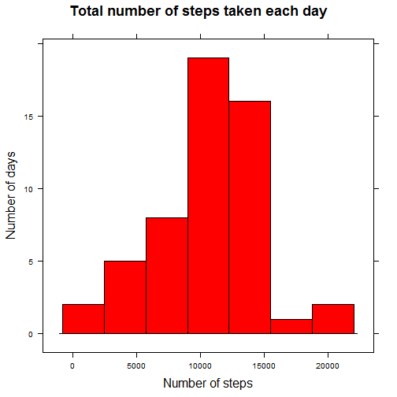
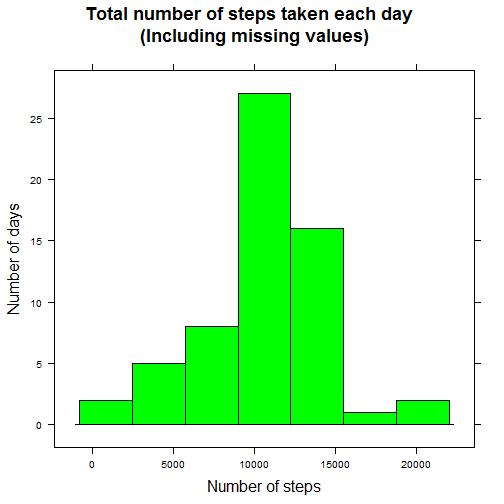

# Data Analysis - Personal Activity Monitoring Devices


## Introduction

It is now possible to collect a large amount of data about personal movement using activity monitoring devices such as a Fitbit, Nike Fuelband, or Jawbone Up. These type of devices are part of the "quantified self" movement - a group of enthusiasts who take measurements about themselves regularly to improve their health, to find patterns in their behavior, or because they are tech geeks. But these data remain under-utilized both because the raw data are hard to obtain and there is a lack of statistical methods and software for processing and interpreting the data.

This assignment makes use of data from a personal activity monitoring device. This device collects data at 5 minute intervals through out the day. The data consists of two months of data from an anonymous individual collected during the months of October and November, 2012 and include the number of steps taken in 5 minute intervals each day.

## Data

The data for this assignment can be downloaded from the course web site:

Dataset: [Activity monitoring data][1] [52K]
[1]:  https://d396qusza40orc.cloudfront.net/repdata%2Fdata%2Factivity.zip
The variables included in this dataset are:

**steps**: Number of steps taking in a 5-minute interval (missing values are coded as NA)

**date**: The date on which the measurement was taken in YYYY-MM-DD format

**interval**: Identifier for the 5-minute interval in which measurement was taken

The dataset is stored in a comma-separated-value (CSV) file and there are a total of 17,568 observations in this dataset.


For this assignment, the instruction and data used can be found in [my github repository](https://github.com/morisgn/RepData_PeerAssessment1). You can downlad the content of the repository to you working directory.


## Loading and preprocessing the data


Unzip the "activity.zip" file to the working directory and check that the file does exist.


```r
unzip("activity.zip")
file.exists("activity.csv")
```

Load the extraxted file into R, and do a basic sanity check of the data.


```r
dataset <- read.csv ("activity.csv" , header= TRUE)
str(dataset)
```

```
## 'data.frame':	17568 obs. of  3 variables:
##  $ steps   : int  NA NA NA NA NA NA NA NA NA NA ...
##  $ date    : Factor w/ 61 levels "2012-10-01","2012-10-02",..: 1 1 1 1 1 1 1 1 1 1 ...
##  $ interval: int  0 5 10 15 20 25 30 35 40 45 ...
```

```r
head(dataset)
```

```
##   steps       date interval
## 1    NA 2012-10-01        0
## 2    NA 2012-10-01        5
## 3    NA 2012-10-01       10
## 4    NA 2012-10-01       15
## 5    NA 2012-10-01       20
## 6    NA 2012-10-01       25
```


Format the interval so it will be represented on x-axis as 01:20 or 23:55  instead of 120 or 2355.


```r
# convert each interval to 4 digit preceded with 0(s) if necessary
intervals <- formatC (dataset$interval, width = 4, flag=0) 
# Concatenate dates and intervals and call it dateTimes
dateTimes <- strptime(paste(dataset$date,intervals), format = "%Y-%m-%d %H%M") 
# Replace the interval in the data set with the appropriate format
dataset$interval <- factor(format(dateTimes, format="%H:%M") )
```

## Mean total number of steps taken per day

I use the aggregate function to calculate the totat number of steps for each day. Days with no steps recorded (missing steps ) will be ignored.

Make a histogram of the total number of steps taken each day by using lattice graphics. 


```r
library(lattice)
totStepsByDay <- aggregate( formula = dataset$steps~dataset$date, data = dataset, FUN = "sum" )
totalSteps <- totStepsByDay [,2] # Get the the total steps for each day

histogram(totalSteps, type=c("count"),
          main=list(label="Total number of steps taken each day", cex=1.5), 
          xlab=list(label="Number of steps",cex=1.3),
          ylab=list(label="Number of days", cex=1.3),
          col = "red")
```

 

Calculate and report the **mean** and **median** total number of steps taken per day.


```r
mean (totalSteps)
```

```
## [1] 10766
```

```r
median (totalSteps)
```

```
## [1] 10765
```


The ***mean*** is  10766 and the **median** is 10765.

## Average daily activity pattern

Make a time series plot (i.e. type = "l") of the *5-minute interval (x-axis)** and the **average number of steps taken, averaged across all days (y-axis)**.


```r
library (ggplot2)

## Compute the average number of steps taken, averaged across all days for each interval
avgStepsByInterval <- aggregate( formula = steps~interval, data = dataset, FUN = "mean" )

## Pick how to break the x-axis
size <- length(avgStepsByInterval$interval)
index <-  round(seq(from=1, to=size, length=20))
mybreaks= avgStepsByInterval$interval [c(index)]


## Plot the figure using ggplot 
ggplot(avgStepsByInterval,  aes(x=interval, y=steps, group=1)) +
        geom_line(lwd= 1, aes(colour = "red")) +
        ggtitle("Average number of steps per interval") +
        labs (x= "Time", y="Number of steps" ) +
        geom_point(colour="red", size=1, shape=21, fill="blue") +
        scale_x_discrete(breaks= mybreaks)  +
        theme(legend.position="none") +
        theme(axis.title.x=element_text(vjust=-.5,size=18)) +
        theme(axis.title.y=element_text(size=18)) +
        theme(plot.title=element_text( vjust=3,face="bold", size=20)) 
```

 

The 5-minute interval, on average across all the days in the dataset, that contains the maximum number of steps.


```r
maxi = max(avgStepsByInterval[,2]) # Get the maximum average of steps
# Get the interval (time) in which the maximum is reach 
inter <- avgStepsByInterval[which(avgStepsByInterval$steps== maxi),1] 
```

The maximum number of steps is the **interval** is 08:35. 

## Imputing missing values

Calculate and report the total number of missing values in the dataset (i.e. the total number of rows with NAs)

```r
sum(!complete.cases(dataset))
```

```
## [1] 2304
```
The total **number of missing values** in the dataset is 2304.

Now I will include the missing values in the calculation. ***The strategy*** I use is to replace the missing values (NA) by the mean of the observed values of the steps in their respective 5-minute interval. 


Create a new dataset that is equal to the original dataset but with the missing data filled in.

```r
## Create the dataset
newDataset <- dataset

## Get the index vector of the missing values (row:col) in the dataset
ind <- which(is.na(newDataset), arr.ind=TRUE) 
rows <- ind[,1]

## For each missing value in the new dataset, replace it by the average of the step in that interval.
for (row in rows) {
   newDataset$steps [row] <- avgStepsByInterval[newDataset$interval[row]==avgStepsByInterval$interval, 2]
}
```

Make a histogram of the total number of steps taken each day for the new dataset.


```r
newTotStepsByDay <- aggregate( formula = newDataset$steps~newDataset$date, data = newDataset, FUN = sum )
newTotalSteps <- newTotStepsByDay [,2] # Get the the total steps for each day

histogram(newTotalSteps, type=c("count"),
          main=list(label=paste("Total number of steps taken each day \n", 
                                "(Including missing values)"), cex=1.5), 
          xlab=list(label="Number of steps",cex=1.3),
          ylab=list(label="Number of days", cex=1.3),
          col = "green")
```

 

Mean and median total number of steps taken per day. 


```r
mean (newTotalSteps)
```

```
## [1] 10766
```

```r
median (newTotalSteps)
```

```
## [1] 10766
```

The ***mean*** is 10766 and the **median** is 10766.

The value of the mean did not change from the first estimate. However, the value of the median has slightly increased compared to the estimates from the first part of the assignment. 

Imputing missing data on the estimates of the total daily number of steps has increased the frequency around the mean. Because we have imputed the missing values in the dataset, the total number of steps has now more values than when computed without missing values.

Total number of steps ***with*** missing values :

```r
length (totalSteps) 
```

```
## [1] 53
```

```r
sort (totalSteps) 
```

```
##  [1]    41   126  2492  3219  4472  5018  5441  6778  7047  7336  8334
## [12]  8355  8821  8841  8918  9819  9900 10056 10119 10139 10183 10304
## [23] 10395 10439 10571 10600 10765 11015 11162 11352 11458 11829 11834
## [34] 12116 12426 12608 12787 12811 12883 13294 13452 13460 13646 14339
## [45] 14478 15084 15098 15110 15414 15420 17382 20427 21194
```

Total number of steps ***without*** missing values :

```r
length (newTotalSteps)
```

```
## [1] 61
```

```r
sort (newTotalSteps)
```

```
##  [1]    41   126  2492  3219  4472  5018  5441  6778  7047  7336  8334
## [12]  8355  8821  8841  8918  9819  9900 10056 10119 10139 10183 10304
## [23] 10395 10439 10571 10600 10765 10766 10766 10766 10766 10766 10766
## [34] 10766 10766 11015 11162 11352 11458 11829 11834 12116 12426 12608
## [45] 12787 12811 12883 13294 13452 13460 13646 14339 14478 15084 15098
## [56] 15110 15414 15420 17382 20427 21194
```


```r
hist(newTotalSteps,  col="green" ,main="Overlapping of New (green) and Old (red) Histogram",
     xlab = "Number of steps")  
hist(totalSteps, col="red", add = TRUE) 
box()
```

 

## Differences in activity patterns between weekdays and weekends

Create a new factor variable in the dataset with two levels - "weekday" and "weekend" indicating whether a given date is a weekday or weekend day.


```r
## Create two vectors for weekdays and weekends 
weekdays <- c ("Monday", "Tuesday", "Wednesday", "Thursday", "Friday" )
weekends <- c ("Saturday" , "Sunday")

## dateTimes is the result of the concatenation of dates and interval in the "Loading" process
## Extract weekdays from the dateTimes variable : Monday, Tuesday, ...Sunday.
days <- weekdays (dateTimes)

## For each day, check wheter or not the day is a weekday or eekend day vectors 
## and change its value accordingly 
for (i in 1:length(days)) {
        if (days [i] %in% weekdays) {
            days [i] <- "weekday"
        } else
        if (days [i] %in% weekends) {
            days [i] <- "weekend"
        }        
   
}

## Add the factor variable "days" in the new dataset.
newDataset$days <- factor (days)
str (newDataset)
```

```
## 'data.frame':	17568 obs. of  4 variables:
##  $ steps   : num  1.717 0.3396 0.1321 0.1509 0.0755 ...
##  $ date    : Factor w/ 61 levels "2012-10-01","2012-10-02",..: 1 1 1 1 1 1 1 1 1 1 ...
##  $ interval: Factor w/ 288 levels "00:00","00:05",..: 1 2 3 4 5 6 7 8 9 10 ...
##  $ days    : Factor w/ 2 levels "weekday","weekend": 1 1 1 1 1 1 1 1 1 1 ...
```


Make a panel plot containing a time series plot (i.e. type = "l") of the 5-minute interval (x-axis) and the average number of steps taken, averaged across all weekday days or weekend days (y-axis).

```r
## Average number of steps taken, averaged across all weekday days or weekend days (y-axis).
library (ggplot2)
stepsMeans <- aggregate(newDataset$steps, by=list(factor(newDataset$interval), newDataset$days), FUN="mean")
colnames(stepsMeans) <- c("interval", "days", "steps") # Rename the column header

## Pick how to break the x-axis
size <- length(stepsMeans$interval)
index <-  round(seq(from=1, to=size, length=10))
mybreaks <- stepsMeans$interval [c(index)]

p <- ggplot(stepsMeans, aes(x=interval, y=steps, group=days)) +
        ggtitle("Number of Steps Taken : Weekdays vs Weekends") +
        labs(list(x = "Time interval", y = "Average Steps")) +
         facet_wrap(~ days , ncol = 1) +
        scale_x_discrete(breaks= mybreaks)  

p + geom_line(colour = "red", size = .8, position="identity")+
        theme(plot.title=element_text( vjust=3,face="bold", size=20)) +
        theme(axis.title.x=element_text(vjust=-.5,size=18)) +
        theme(axis.title.y=element_text(size=18)) +
        theme(strip.text.x = element_text(size = 16), 
              strip.background = element_rect(colour="red", fill="#CCCCFF"))
```

 
